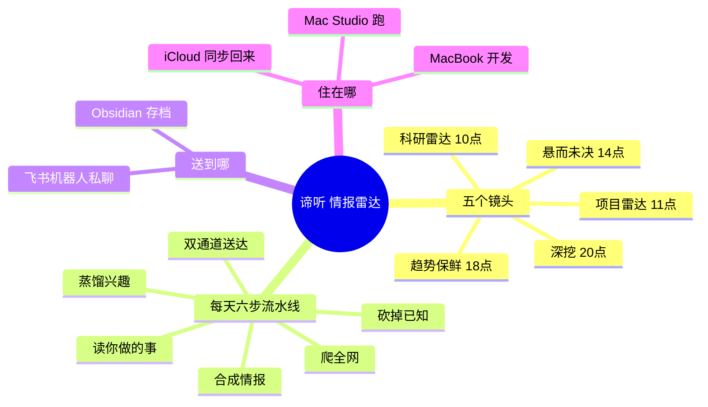
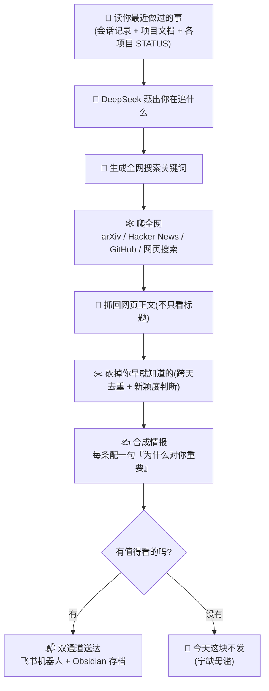
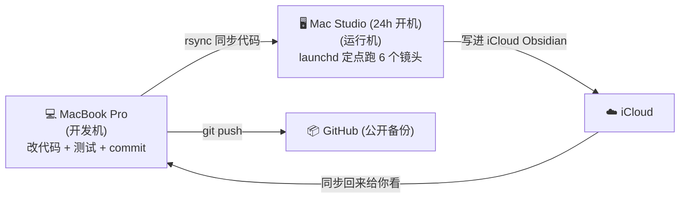

# 🛰️ 谛听 · 个人技术情报雷达

> 一个住在你 **Mac Studio**（24 小时开机）里的「技术情报小秘书」：每天自动读你最近做过的事 → 用大模型看出你在追什么 → 去全网帮你扒最新、最相关、你还**不知道**的技术料 → 挑出值得看的 → 送到你的飞书和 Obsidian。

**名字由来**：谛听是地藏菩萨座下的神兽，伏地侧耳就能听辨三界、知善恶真假——正好配一台「超感知」的情报雷达。

**核心理念：宁缺毋滥**（precision-first）——它宁可今天什么都不发，也不发一堆没用的来烦你。

---

## 😖 它治哪三个痛

| 痛点 | 谛听怎么救 |
|------|-----------|
| 🛞 **重复造轮子** —— "原来别人早做好了，我白忙活了" | 帮你先看看有没有现成的 |
| 🕰️ **信息过时** —— "我用的还是老办法，其实有更好的" | 帮你盯方向上的最新进展 |
| 🧗 **卡点没人帮** —— "卡在这儿好几天了" | 帮你找解法，甚至找反方意见提醒你别踩坑 |

---

## 🧠 一张图看懂谛听全貌

---

## 🔄 每天它怎么干活（六段流水线）

每个镜头都走这条「读 → 蒸 → 爬 → 砍 → 合 → 送」的流水线：

---

## 🔭 五个镜头总览（每天定点自动跑）

| 时间 | 镜头 | 帮你找什么 | 产出 |
|------|------|-----------|------|
| **10:00** | 🔭 **科研雷达** (research) | 你在追的方向有没有更好的方法、最新论文、最佳实践 | 几条精选短情报 |
| **11:00** | 📁 **项目雷达** (project) | 只为「STATUS 变了」的项目单独扒和它直接相关的料 | `谛听项目情报/<项目>.md` |
| **14:00** | 🧩 **悬而未决 + 反方** (loops) | (a) 你的卡点有没有人给了解法；(b) 你的决定有没有人唱反调 | 解法 + 反对证据 |
| **18:00** | 🛰️ **趋势保鲜** (trends) | 你关注的开源项目有没有出新版本 | 版本更新通知 |
| **20:00** | 🔬 **深挖** (dig) | 针对一个具体话题做一次性深度调研 | 一篇结构完整的长资料 |

> 另有 4 次 **prefetch**（每个镜头前 10 分钟）把 iCloud「影子文件」拉回本地，防止读笔记时卡死。

---

## 🙋 你怎么用它（日常就三件事）

谛听是**全自动**的，正常情况你什么都不用做，每天等着收情报就行。偶尔会用到：

| 想干啥 | 怎么做 |
|--------|--------|
| **每天去哪看情报** | 飞书机器人「皇后的小跟班」私聊 + Obsidian `Inbox/YYYY-MM-DD 谛听情报.md`；深挖长资料在 `谛听深挖/` |
| **指定深挖某话题** | 让 Claude 往 `state/dig_queue.yaml` 加一行 `- "话题"`（清单优先级最高） |
| **立刻手动跑某镜头** | 跟 Claude 说"手动跑一下 dig 镜头"，它会 `ssh macstudio` 帮你跑 |
| **确认定时还在跑** | `ssh macstudio 'launchctl list \| grep diting'`（应列出 6 个） |

---

## 🏗️ 它住在哪（开发机 ≠ 运行机）

| 位置 | 角色 | 路径 |
|------|------|------|
| **MacBook（开发机）** | 改代码 + 测试 + commit/push | `/Users/<dev-user>/diting-radar` |
| **Mac Studio（运行机 <run-user>，24h）** | 实际跑 launchd 的地方 | `/Users/<run-user>/diting-radar` |
| **GitHub** | 远程公开备份 | `github.com/hailanlan0577/diting-radar`（public） |

> ⚠️ 改代码流程见 `CLAUDE.md`「部署工作流」。两个易翻车的坑：MacBook 别用裸 `python`（被 alias 到系统版）；rsync 同步时别拿 MacBook 版覆盖 Mac Studio 定制的 `run-lens.sh` / `config.yaml`。

---

## 🧱 技术栈

Python 3.11 · **DeepSeek V4 Pro**（全程大模型：蒸馏/查询/合成）· scrapling（抓正文 + 兜底搜索，含隐身反爬）· trafilatura（正文抽取）· httpx · sqlite3（去重库）· 116 个自动化测试。投递走飞书 `lark-cli`（机器人身份）+ 本地 Obsidian 文件。

---

## 📚 文档导航

| 文档 | 什么时候读 |
|------|-----------|
| `ONBOARDING.md` | 新 Claude 窗口接手，60 秒进入状态 |
| `CLAUDE.md` | 想跑/部署/连飞书、了解代码地图 |
| `STATUS.md` | 想知道每天做了什么、下一步、下次第一件事 |
| `RUNBOOK.md` | 自动任务没发情报 / 要换 key / 要重建 / 紧急救命 |
| `docs/superpowers/specs/` | 完整设计文档（v1+v2 由此而来） |

> 详细的图文使用手册（含 dig 选题逻辑、配置逐项说明、排查手册）在 Obsidian `项目/2026-06-18 谛听 完整流程图与使用手册.md`。

---

## 🔑 隐私说明

这是 **公开仓库**。真实密钥/配置（`config.yaml` / `~/.diting.env` / `state/`）已全部 `.gitignore`、永不入库；文档里的真实路径、飞书 ID 已脱敏为占位符。DeepSeek key 从运行机本地 `~/.openclaw/openclaw.json` 读，不写死在代码里。
